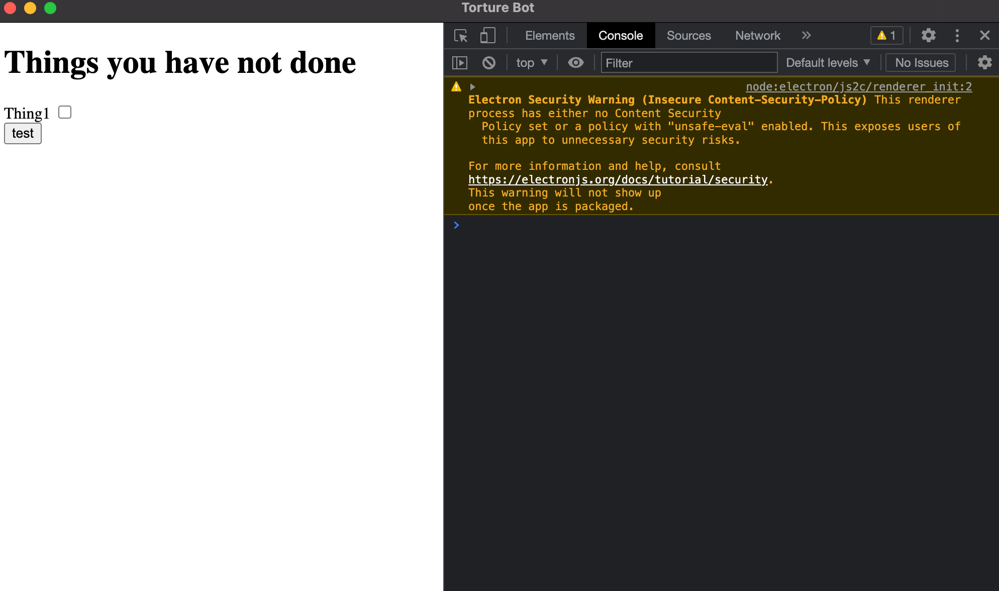

# Project oriented learning strategy
Based on my personal experience, the quickest and most efficient way of learning a new programming language is by 
reproducing a real world project. 
Therefore I will try to create a project using JS each week and summarize my learning through the process.


## Project Idea: Torture Bot
I have always wanted to implement application that can be used on my daily life.
There has been a project idea that I had in mind for a while, and I think it will be great if it is implemented using JS.

Torture Bot, a todo list notification desktop application that keep track of the tasks that are not 
done and constantly annoy(torture) you by sending notifications to remind you.

### Technology
- JavaScript
- HTML
- Election

JavaScript is a programming language primary used for website frontend programming and used other frameworks to build 
server side application, mobile application with React. 

Election is a framework for JavaScript to creat cross platform desktop application

### What I learned this week
Declare variables in js using the `const` or `let` keyword
```javascript
const {app, BrowserWindow } = require('electron');
let task1 = new Task("Some task");
```
Create new instant of a class with `new` keyword,
and define parameters with `name : name` similar to JSON
```javascript
const mainWindow = new BrowserWindow({
    title: 'TITLE',
    width: 500,
    height: 600,
    webPreferences: {
        nodeIntegration: true,
        contextIsolation: false,
        enableRemoteModule: true,
    }
});
```
Declare a function using `function` keyword, and class using `class` keyword
```javascript
function createMainWindow() {
    const mainWindow = new BrowserWindow({
        title: 'TITLE',
        width: isDev ? 1000: 500,
        height: 600,
        webPreferences: {
            nodeIntegration: true,
            contextIsolation: false,
            enableRemoteModule: true,
        }
    });


class Task {
  constructor(title) {
    this.title = title;
  }

  printInConsole() {
    console.log(`Task: ${this.title}`);
  }
}}
```
To start the electron application 
```javascript
app.whenReady().then(() => {
    createMainWindow()})
```
then in the terminal `npm run start` will start the project and create a desktop app window

To automatically rerun the project on save, use `npx electronmon .` to automatically recompile the project on save, so
I don't have to terminate and re-run `npm run start` everytime.

### how it looks



